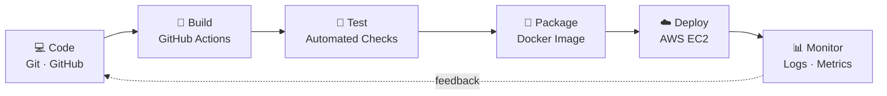
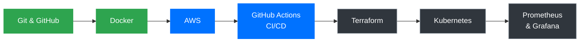

<div align="center">


[](https://github.com/Srijapotha)


</div>

---

## 💻 whoami

```bash
$ whoami
srija — DevOps Engineer

$ cat focus.txt
CI/CD  |  Cloud (AWS)  |  Containers  |  Infrastructure as Code  |  Monitoring

$ cat principles.txt
1. Automate anything you do twice
2. Secure by default
3. If it isn't measured, it isn't managed

$ echo $STATUS
Open to DevOps opportunities 🚀
```

---

## 🔄 Pipeline I Build



---

## 🧰 Tech Stack

### ⚡ Working With


### 🌱 Currently Learning


---

## 🗺️ My DevOps Roadmap



<div align="center">

🟢 **Working** &nbsp;·&nbsp; 🔵 **In progress** &nbsp;·&nbsp; ⚫ **Up next**

</div>

---

## 🚀 Featured Projects

| Project | Description | Tech |
|:--|:--|:--|
| 🔁 **[CI/CD Pipeline](https://github.com/Srijapotha)** | Automated build, test, image push and deploy on every commit | `GitHub Actions` `Docker` `AWS` |
| 🐳 **[Dockerized Application](https://github.com/Srijapotha)** | Multi-container app with networking, volumes and env configs | `Docker` `Compose` |
| ☁️ **[AWS Deployment](https://github.com/Srijapotha)** | EC2 + S3 hosting with IAM least privilege and Nginx | `AWS` `Nginx` `Linux` |
| 🏗️ **[Terraform IaC](https://github.com/Srijapotha)** | VPC, EC2 and S3 provisioned as reusable code | `Terraform` `AWS` |
| ☸️ **[Kubernetes Deployment](https://github.com/Srijapotha)** | Deployments, services and rolling updates | `Kubernetes` |

---

## 🧭 How I Work

- 🔁 **Automate first**: repeatable pipelines over manual steps
- 📦 **Containerize everything**: the same environment from laptop to production
- 🔐 **Security by default**: least-privilege IAM, no secrets in code
- 📝 **Document as I build**: every repo has a README and an architecture diagram
- 📊 **Measure**: logs and metrics before opinions

<details>
<summary><b>🛠️ DevOps Practices (click to expand)</b></summary>
<br>

- ✅ CI/CD pipeline design and automation
- ✅ Containerization and reproducible environments
- ✅ Infrastructure as Code
- ✅ Monitoring, logging and alerting
- ✅ Git branching strategies and code review workflows
- ✅ Cloud security basics: IAM least privilege, secrets management

</details>

<details>
<summary><b>🎓 Certification Goals (click to expand)</b></summary>
<br>

- ☁️ AWS Certified Cloud Practitioner
- ☸️ Certified Kubernetes Administrator (CKA)
- 🏗️ HashiCorp Terraform Associate

</details>

---

## 📊 Engineering Dashboard

<div align="center">


<br>


</div>

---

## 🛰️ System Status

```yaml
engineer:
  name: Srija Potha
  role: DevOps Engineer
  status: open_to_opportunities
  building:
    - CI/CD pipeline with GitHub Actions
    - Dockerized multi-container app
    - AWS deployment with Nginx
  next_up:
    - Terraform
    - Kubernetes
    - Prometheus + Grafana
  location: India
```

---

## 📬 Let's Connect

<div align="center">

```bash
$ ./contact.sh --open-to "DevOps roles, collaborations, mentoring"
```

[](https://linkedin.com/in/p-sreeja-31b557230)
[](mailto:pothasrija941@gmail.com)
[](https://x.com/srija941)
[](https://portfolio-srijapotha.vercel.app)

*Automate everything, deploy with confidence, and keep learning.*


</div>
