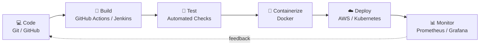

  

  

  
  
  
  

---

## 👩‍💻 About Me

I'm a **DevOps Engineer** who builds the bridge between code and production. I design **CI/CD pipelines**, containerize applications and automate cloud deployments, so teams can ship **faster, safer and more reliably**.

- ⚙️ Focus: **CI/CD • Cloud • Containers • Infrastructure as Code • Monitoring**
- 🔐 Mindset: automate repetitive work, secure by default, measure everything
- 🌱 Always learning through **hands-on labs and real-world projects**

---

## 🔄 DevOps Workflow I Work With

---

## 🧰 Tech Stack

**☁️ Cloud**  

**🔁 CI/CD**  

**🐳 Containers & Orchestration**  

**🏗️ Infrastructure as Code & Automation**  

**📊 Monitoring & OS**  

**🔧 Version Control**  

---

## 🚀 Featured Projects

| Project | What it does | Stack |
|---|---|---|
| 🔁 **CI/CD Pipeline** | Automated build → test → deploy on every push | GitHub Actions, Docker, AWS |
| 🐳 **Containerized App** | Multi-container setup with networking and volumes | Docker, Docker Compose |
| ☁️ **AWS Infrastructure** | VPC, EC2, S3 and IAM provisioned as code | Terraform, AWS |
| ☸️ **Kubernetes Deployment** | Deployments, services, rolling updates | Kubernetes, Helm |
| 📊 **Monitoring Stack** | Metrics, dashboards and alerts | Prometheus, Grafana |

> 📌 *Add the repo link to each project.*

---

## 📈 Impact

<!-- Replace with YOUR real numbers once you have them -->
- ⏱️ Reduced deployment time from **[X min]** to **[Y min]** with automated pipelines
- 🔁 Automated **[N]** manual deployment steps
- 🐳 Containerized **[N]** applications for consistent environments

---

## 🎓 Certifications & Learning

- 🎯 AWS Certified Cloud Practitioner / Solutions Architect *(in progress / add when earned)*
- 📘 Kubernetes (CKA) *(planned)*
- 📘 Terraform Associate *(planned)*

---

## 📊 GitHub Stats

  
  

  

---

## 📬 Let's Connect

  
  
  
  

<i>"Automate everything, deploy with confidence, and keep learning."</i>

  

