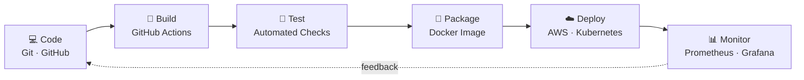

---

## 👩‍💻 About Me

DevOps Engineer focused on **automating the path from code to production**. I build CI/CD pipelines, containerize applications and deploy them on cloud infrastructure, with an emphasis on **reliability, repeatability and security**.

> 💡 *"If you have to do it twice, automate it."*

| | |
|---|---|
| 🎯 **Focus** | CI/CD · Cloud · Containers · Infrastructure as Code · Monitoring |
| 🔐 **Mindset** | Automate repetitive work · Secure by default · Measure everything |
| 🌱 **Learning** | Kubernetes · Terraform · Observability · DevOps with AI tooling |

---

## 🔄 Workflow I Build

---

## 🧰 Tech Stack

**☁️ Cloud**

**🔁 CI/CD**

**🐳 Containers & Orchestration**

**🏗️ Infrastructure as Code & Automation**

**📊 Monitoring & OS**

**🔧 Version Control**

---

## 🚀 Featured Projects

| # | Project | What it does | Stack |
|:-:|---|---|---|
| 1 | 🔁 **[CI/CD Pipeline](#)** | Build → test → push image → deploy on every commit | `GitHub Actions` `Docker` `AWS EC2` |
| 2 | 🐳 **[Dockerized Application](#)** | Multi-container app with networking and volumes | `Docker` `Docker Compose` |
| 3 | ☁️ **[AWS Infrastructure as Code](#)** | VPC, EC2, S3 and IAM provisioned with modules | `Terraform` `AWS` |
| 4 | ☸️ **[Kubernetes Deployment](#)** | Deployments, services, rolling updates | `Kubernetes` `Helm` |
| 5 | 📊 **[Monitoring & Alerting](#)** | Metrics, dashboards and alert rules | `Prometheus` `Grafana` |

---

## 🛠️ DevOps Practices

- ✅ CI/CD pipeline design and automation
- ✅ Infrastructure as Code and reproducible environments
- ✅ Containerization and orchestration
- ✅ Monitoring, logging and alerting
- ✅ Git branching strategies and code review workflows
- ✅ Cloud security basics: IAM least privilege, secrets management

---

## 📈 GitHub Analytics

---

## 🎓 Certifications

- ☁️ AWS Certified Cloud Practitioner *(add when earned, or "In progress")*

---

## 📬 Let's Connect

