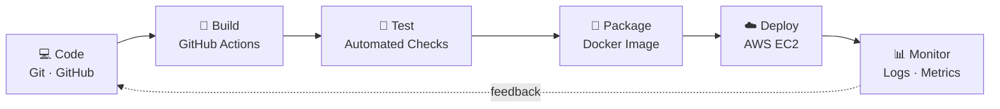

---

## 👩‍💻 About Me

DevOps Engineer focused on **automating the path from code to production**. I build CI/CD pipelines, containerize applications and deploy them on cloud infrastructure, with an emphasis on **reliability, repeatability and security**.

> 💡 *If you have to do it twice, automate it.*

| | |
|:--|:--|
| 🎯 **Focus** | CI/CD · Cloud · Containers · Infrastructure as Code · Monitoring |
| 🔐 **Principles** | Automate repetitive work · Secure by default · Measure everything |
| 🌱 **Learning** | Kubernetes · Terraform · Observability |

---

## 🔄 The Pipeline I Build

---

## 🧰 Tech Stack

**Working with**

**Learning (projects in progress)**

---

## 🚀 Featured Projects

| # | Project | What it does | Stack |
|:-:|---|---|---|
| 1 | 🔁 **[CI/CD Pipeline](https://github.com/Srijapotha)** | Build → test → push image → deploy on every commit | `GitHub Actions` `Docker` `AWS EC2` |
| 2 | 🐳 **[Dockerized Application](https://github.com/Srijapotha)** | Multi-container app with networking and volumes | `Docker` `Compose` |
| 3 | ☁️ **[AWS Deployment](https://github.com/Srijapotha)** | EC2 + S3 hosting with IAM least privilege | `AWS` `Nginx` `Linux` |
| 4 | 🏗️ **[Terraform IaC](https://github.com/Srijapotha)** | VPC, EC2 and S3 provisioned as code | `Terraform` `AWS` |
| 5 | ☸️ **[Kubernetes Deployment](https://github.com/Srijapotha)** | Deployments, services, rolling updates | `Kubernetes` |

> 📌 Replace each link with the exact repo URL, and remove any project you haven't built yet.

---

## 🛠️ DevOps Practices

✅ CI/CD pipeline design and automation  
✅ Containerization and reproducible environments  
✅ Infrastructure as Code  
✅ Monitoring, logging and alerting  
✅ Git branching strategies and code review workflows  
✅ Cloud security basics: IAM least privilege, secrets management  

---

## 📈 GitHub Stats

---

## 📬 Let's Connect

*Automate everything, deploy with confidence, and keep learning.*

